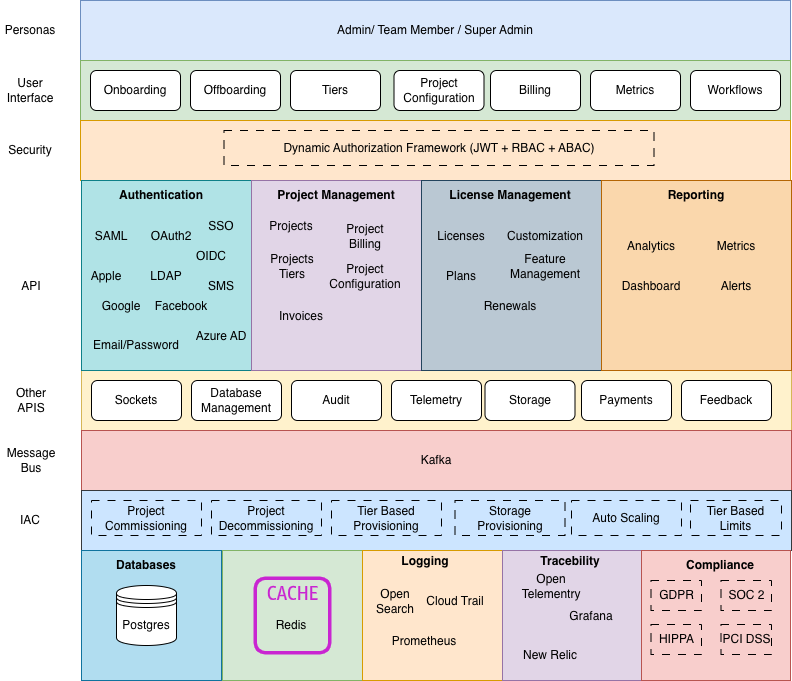
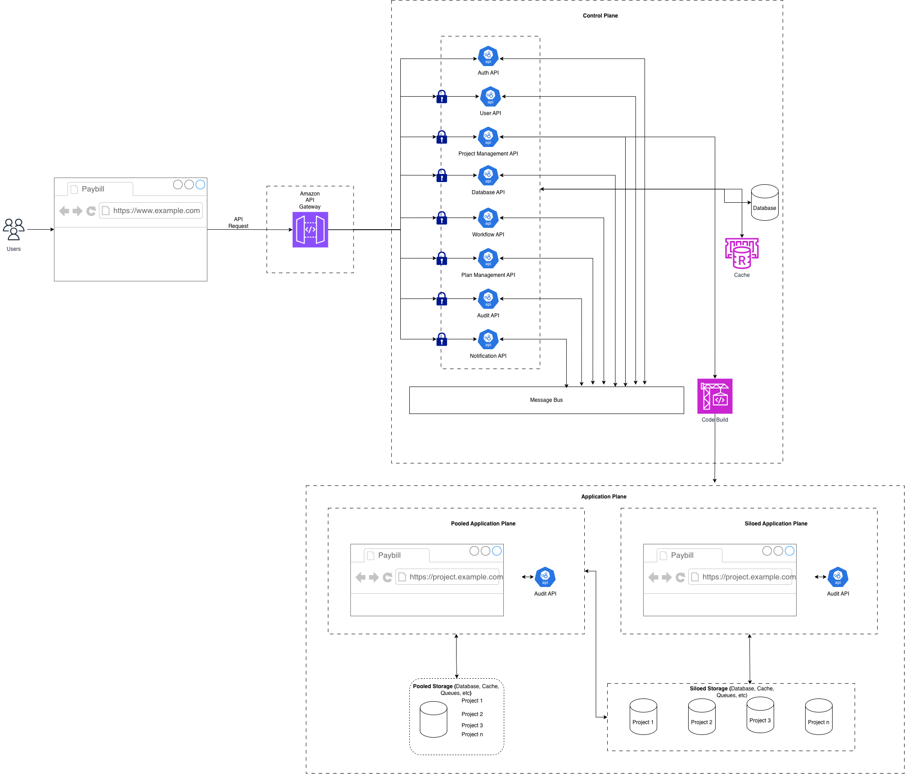

  <a href="https://paybill.dev" target="_blank">
    <picture>
      <!-- Dark mode -->
      <source srcset="https://paybill.dev/logo-wordmark--dark.png" media="(prefers-color-scheme: dark)" />
      <!-- Light mode (default) -->
      
    </picture>
  </a>

**Paybill** builds foundational platforms for **modern SaaS systems** and **safe AI-driven applications**.

We focus on **control, predictability, and security** — enabling platforms and agents to operate within clearly defined boundaries rather than unchecked automation.

> :warning: This project is under development.

> :info: If your looking for a demo or support [<admin@paybill.dev>](mailto:<admin@paybill.dev>).

# Platform Api

Platform Api is an **EKS-based Multi-Tenant SaaS solution** designed to deploy and manage control plane and tenant infrastructure in a secure, scalable, and GitOps-driven manner.

## CI/CD & Deployment Pipelines

The platform supports multiple CI/CD providers for deploying control plane infrastructure and applications:

- **AWS CodePipeline** (Production-ready)
- **Azure DevOps Pipelines** (Pending implementation)
- **Google Cloud Build + Cloud Deploy** (Pending implementation)
- **IBM DevOps** (Pending implementation)
- **Oracle DevOps Cloud Service** (Pending implementation)

## Control Plane Capabilities

The control plane is responsible for provisioning and managing:

- Networking
- Compute
- Databases
- Monitoring & Logging
- Security
- Control plane applications (deployed via Helm charts)

## Tenant Management & Onboarding

- Automatically provisions **tenant-specific CodeBuild projects**
- Supports onboarding of:
  - Silo tenants
  - Pooled tenants
- Each tenant has:
  - Dedicated infrastructure
  - Dedicated application Helm charts

## GitOps & Workflow Automation

- Tenant infrastructure and applications are managed using GitOps tools:
  - Argo CD
  - Argo Workflows

## Security & Isolation

- Enforces **strict IAM policies**
- Applies **Kubernetes Authorization Policies**
- Prevents **cross-namespace access** between tenants

    <picture>
      
    </picture>

    <picture>
      
    </picture>

## AWS Procedure Requirements

For more details, you can go through the [aws documentation](https://github.com/paybilldev/terraform-aws-platform-builder/README.md).

## Azure Procedure Requirements

For more details, you can go through the [azure documentation](https://github.com/paybilldev/terraform-azure-platform-builderREADME.md).

## GCP Procedure Requirements

For more details, you can go through the [gcp documentation](https://github.com/paybilldev/terraform-gcp-platform-builder/README.md).

## IBM Procedure Requirements

For more details, you can go through the [ibm documentation](https://github.com/paybilldev/terraform-ibm-platform-builder/README.md).

## Oracle Procedure Requirements

For more details, you can go through the [oracle documentation](https://github.com/paybilldev/terraform-oracle-platform-builder/README.md).
